# Accepted implementation handoff

Product: zudo-ez-host. Six prototype rounds accepted, including final dashed-tree, checkpoint-browser and full-page review corrections. Serve this directory with any static server and open index.html. No external runtime services are required. Pages contain fictional project data and simulated operations; they do not implement sync. Only the current boot paths are authoritative: accumulated shared.js/CSS contains inactive helpers from earlier rounds, so do not port it wholesale.

The prototype is direction for structure and behavior, not a pixel spec. Port its layout and interaction using the project's real design tokens and components; do not copy mock values. Exact visual requirements are named explicitly.

## Requirements and feedback history

Added: zudo-ez-host corrected name; independent projects; desktop launch state checks; simple upload-first list, filter and remembered display fields; explicit Push & publish with secondary checkpoint-only/publish-saved; read-only web and full local desktop; CLI macOS/WSL/Linux and headless MCP; Default/Ink/Quiet with System/Light/Dark; shared icons; GitHub file-based A/B comparison; current tree/content/metadata viewer; exact 1px dashed tree geometry; Browse files on every checkpoint with pinned revision; full-page incoming/local/conflict review with inline replacement confirmation; safe syntax highlighting.
Removed: Dropbox-style silent upload/publication, workbench/editor relationships, complex home dashboard and large bulk-sync banner, diff dialogs, solid indentation tree connectors, web local-write controls.
Superseded: automatic one-way publication -> explicit guarded push/pull with saved/live separation; generic history compare -> file-based A/B pages; current-files-only -> both current sources and immutable per-checkpoint browser; pull diff dialog -> left changed-files/right selected-diff page; older theme source -> accepted shared design reference. Added after plan review: Smart merge is the third choice, using Git-style three-way merge with explicit unresolved-conflict handling. This supersedes the planning default that deferred automatic non-conflicting merge.

## Architecture decisions

Rust native core shared directly by CLI/MCP/Tauri follows the existing ADR and avoids a second local runtime. TS core remains browser/Worker-safe with cross-language conformance fixtures; risk is semantic drift, tested by identical corpora.
MCP runs as a CLI stdio subcommand to minimize packaging; no running desktop required. Browserless enrollment and no-keyring behavior are required, not left to a macOS-only happy path.
Saved and live heads are independent. Combined push-and-publish reports partial success honestly. Checkpoint restore preserves history; conflict replacement requires fresh preview and recovery. User explicitly requires Smart merge: automatically combine non-conflicting three-way changes, then resolve remaining conflicts before local application. Automatic background sync remains excluded.
Retain default immediate-child sync-root discovery plus explicit machine-local attach mapping. Projects have no relationships; overlapping roots fail validation. Web is read-only beyond authentication/session lifecycle and local appearance preferences.
Three named themes use app-owned semantic tokens; syntax highlighting is an isolated dependency adapter with escaped fallback. Prototype implementation is illustrative and contains legacy inactive functions; never port shared.js wholesale.
Web assets default to same-origin control-worker delivery, separate from public hosted-site worker. No production deploy is part of this plan execution without operator prerequisites. Migrations use real staging backup/dry-run/rollback rather than assuming unreleased means disposable data.
Only 16 GiB free at planning time: all native compile-owning tasks are one dependency chain. Use one native target/worktree at a time, reclaim workflow-owned build artifacts when safe, and preflight disk before compiling; if insufficient, use CI build artifacts/runner rather than silently delete user files. Full repo builds/browser suites centralized. UI/backend tasks use changed-scope checks and do not invoke Rust builds.
Keep current eligible-file exclusions across saved and published snapshots; pulls own only managed paths and never mirror-delete local-only descendants. Existing session mutations are inventoried and narrowed while auth/bootstrap/consent remains explicitly allowed.

## Required implementation guidance

Consult css-wisdom and test-wisdom whenever available. The transferable rules applied here are self-contained:

- Component-first Preact with Tailwind v4 and owned primitive → semantic → component tokens; no raw feature-local palette/spacing values. Use the supplied design-system/SKILL.md as the accepted app specification and migrate it into a durable project skill.
- Three palettes Default/Ink/Quiet and independent System/Light/Dark. Tokens and all file/diff states must remain readable in all combinations. Exact tree geometry is in the design-system reference.
- Test at the lowest level that can observe the contract. Pure logic uses unit/conformance tests; real HTTP/IPC/filesystem behavior requires transport/native tests; browser interaction uses central browser scenarios; CSS needs measured geometry/computed styles plus screenshots.
- Fake desktop behavior at its real bridge boundary; fake web HTTP at HTTP. Contract-test the production transport bypassed by the fake. Browser WebKit is not packaged Tauri proof.
- Keep a per-contract verification map with reproducible command, claim, limits, environment, status. Never mark missing platform/live/signing evidence proven. Distinguish one-off verification artifacts from deliberate regression gates; do not silently graduate them.
- Keep full suites centralized; serialize native compile owners and preflight disk. No production deploy is implied.

CSS article identifiers: architecture/component-first-strategy.mdx; color/three-tier-color-strategy.mdx; design-tokens/app-spacing-architecture.mdx; design-principles/shape-language.mdx.
Testing article identifiers: decision-guide/required-behavior.mdx; decision-guide/execution-tiers.mdx; decision-guide/external-service-seam.mdx; test-integrity/verification-map.mdx.

## Safe syntax highlighting pattern

Use a narrow highlight-only adapter with isolated emitted assets. Preserve full-file lexical state before mapping tokens into line/diff ranges; tokenize A and B separately. Render escaped text or structured source-preserving spans, not arbitrary HTML. Semantic syntax foreground must coexist with diff backgrounds and +/- marks. Unknown languages/errors fall back to escaped plain text. Bound bytes/lines/time, discard stale async work, and prove CRLF/newline/source fidelity. Do not assume a full-pre/code HTML API supplies diff-ready token arrays. Verify released dependency exports/licenses before selection; do not depend on another local project.

## Screenshot contracts

### home.png

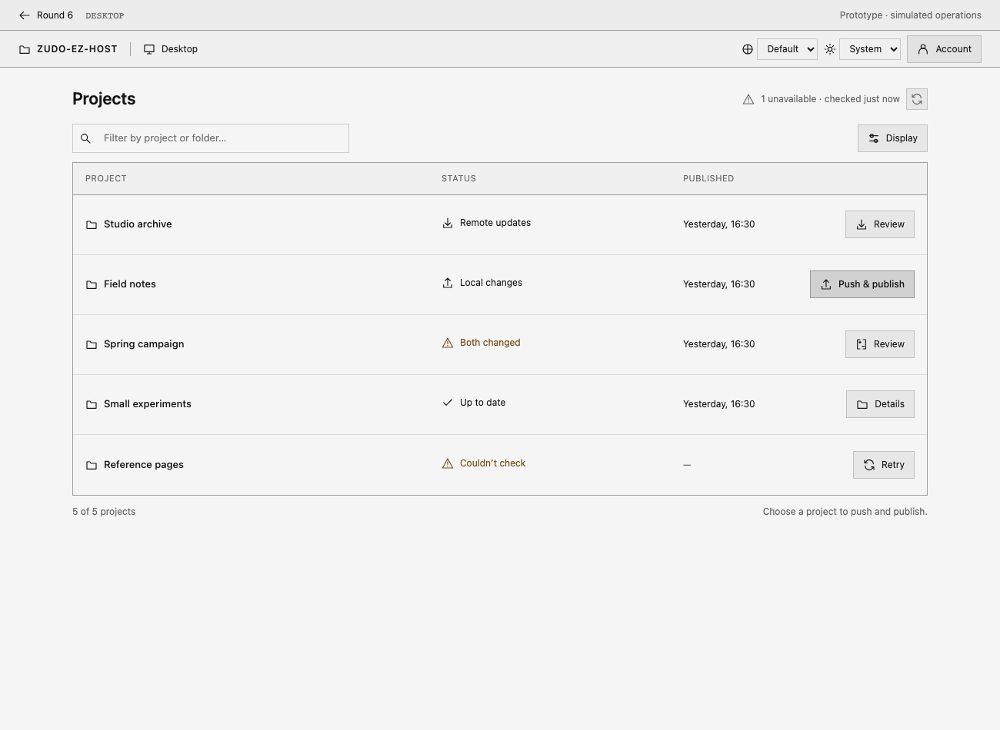

Expected: Upload-first project list; compact state checking, filter and Display. Forbidden: Workbench/global editing target or bulk-sync dashboard. Unknown: Actual network timing and progress durations. Viewport: 1300×950; also verify 760 and 390 widths with no page overflow, stacked panels and narrow unified diffs.

### history.png

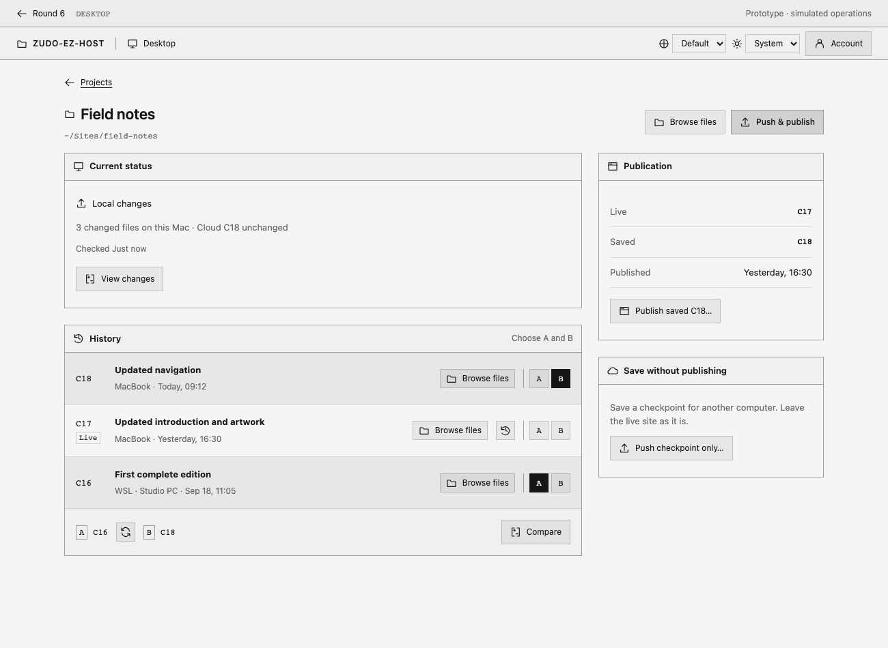

Expected: Independent project detail; saved/live distinction, A/B and Browse files on every checkpoint. Forbidden: Missing Browse on older history, implicit publish on restore. Unknown: Pagination size and final production wording. Viewport: 1300×950; also verify 760 and 390 widths with no page overflow, stacked panels and narrow unified diffs.

### web-home.png

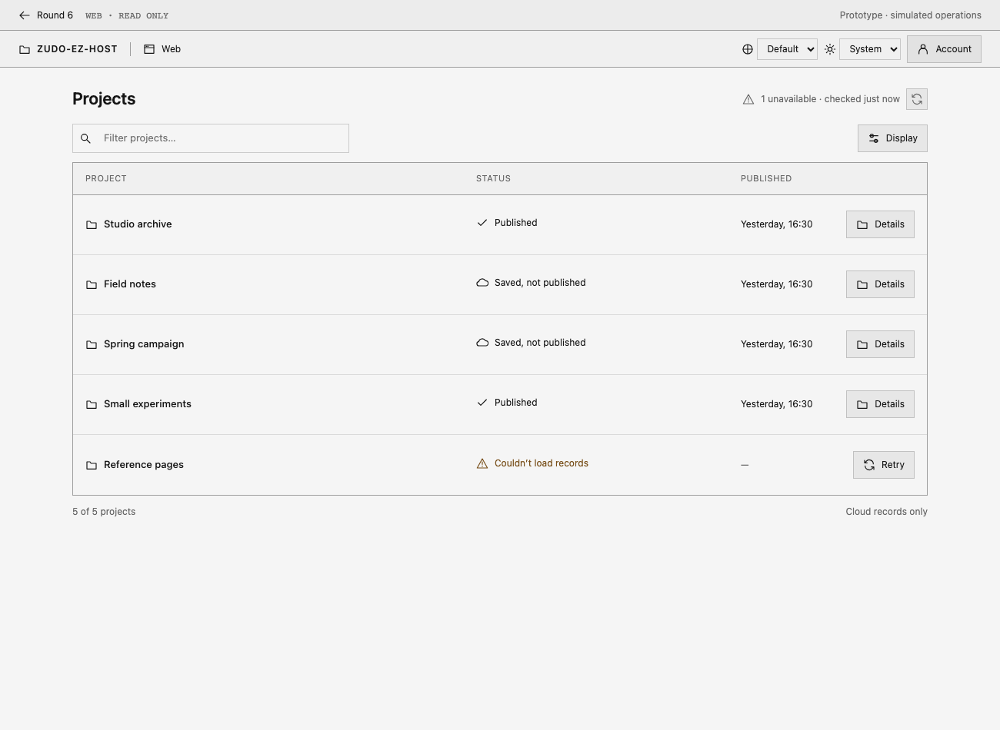

Expected: Read-only cloud list and account/device views. Forbidden: Local folder authority or mutation controls. Unknown: Login screen detail. Viewport: 1300×950; also verify 760 and 390 widths with no page overflow, stacked panels and narrow unified diffs.

### comparison.png

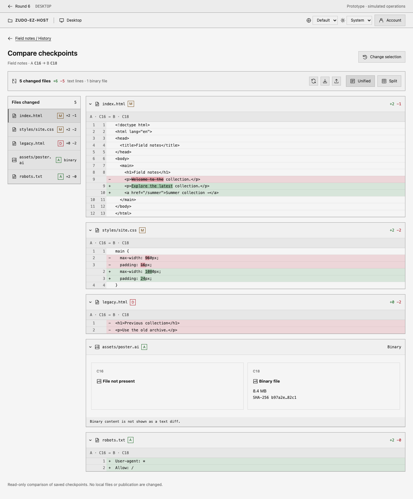

Expected: File sidebar plus stacked collapsible per-file A/B diffs. Forbidden: Monolithic raw diff or diff dialog. Unknown: Syntax token color details; implement semantic palette roles. Viewport: 1300px wide, full-page capture; also verify 760 and 390 widths with no page overflow, stacked panels and narrow unified diffs.

### tree-fixed-1300-dark.png

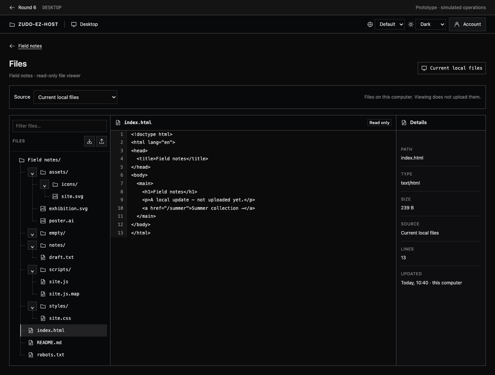

Expected: Dashed tree with boxed disclosure and content/metadata view. Forbidden: Solid indentation lines, leaf toggle spacers, executable source. Unknown: Large-tree performance beyond visible sample. Viewport: 1300×950 dark; also verify 760 and 390 widths with no page overflow, stacked panels and narrow unified diffs.

### history-files-C16.png

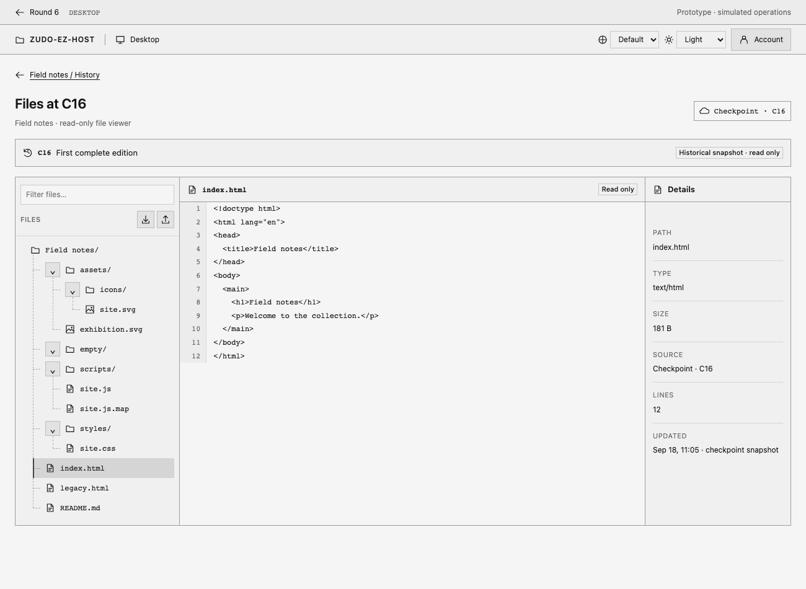

Expected: Complete file tree pinned to exact historical checkpoint. Forbidden: Latest/local fallback or missing historical membership. Unknown: Unavailable remote latency. Viewport: 1300×950; also verify 760 and 390 widths with no page overflow, stacked panels and narrow unified diffs.

### pull-review-page.png

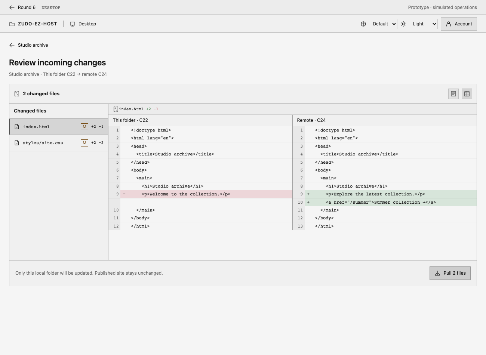

Expected: Left changed-file list/right selected diff, page-level action. Forbidden: Dialog-based review. Unknown: Actual transfer timing. Viewport: 1300×950; also verify 760 and 390 widths with no page overflow, stacked panels and narrow unified diffs.

### pull-review-390.png

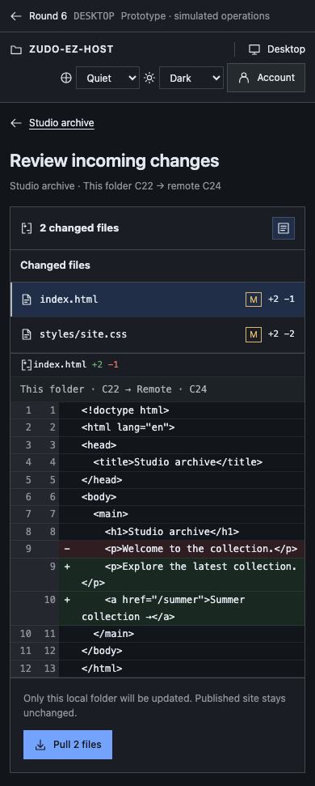

Expected: Stacked file list/diff, unified narrow layout. Forbidden: Horizontal page overflow or hidden action. Unknown: Native OS chrome. Viewport: 390×950; also verify 760 and 390 widths with no page overflow, stacked panels and narrow unified diffs.

### smart-merge.png

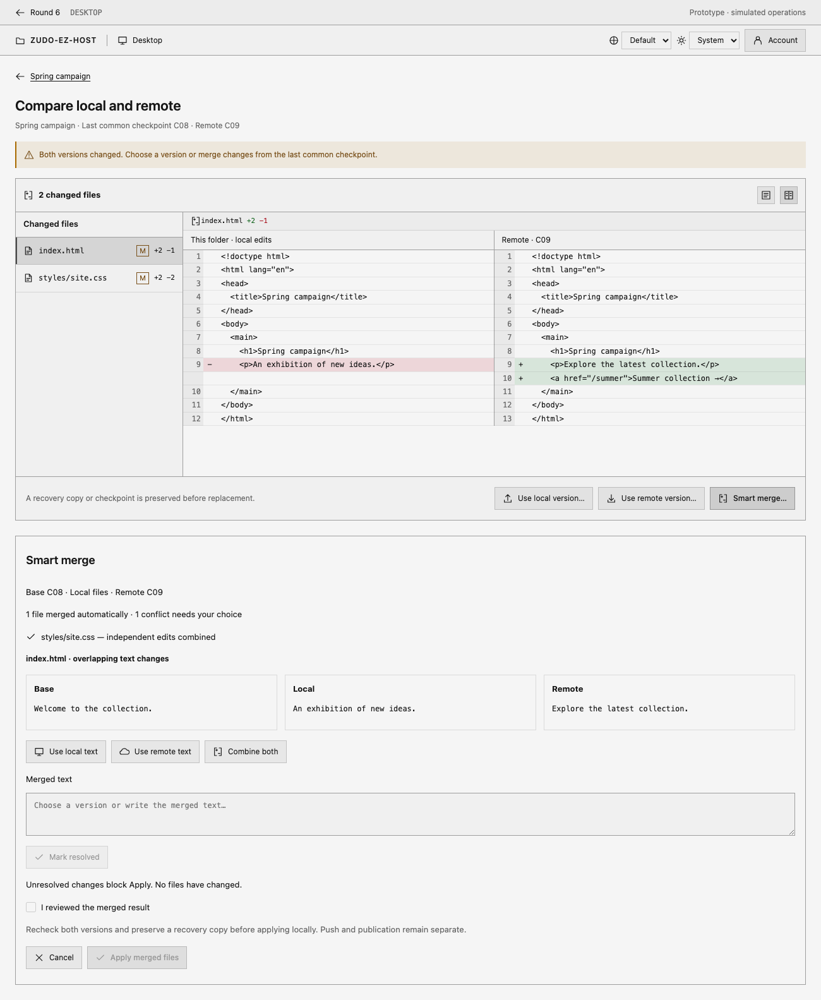

Expected: Third Smart merge action with base/local/remote, auto-merged files and unresolved blocking; explicit local apply. Forbidden: Diff dialog, unresolved apply, automatic cloud push/publication. Unknown: Production merge algorithm, non-text conflict editors and transfer timing. Viewport: 1300×950, full-page; also verify 760 and 390 widths with no page overflow, stacked panels and narrow unified diffs.

### smart-merge-ready.png

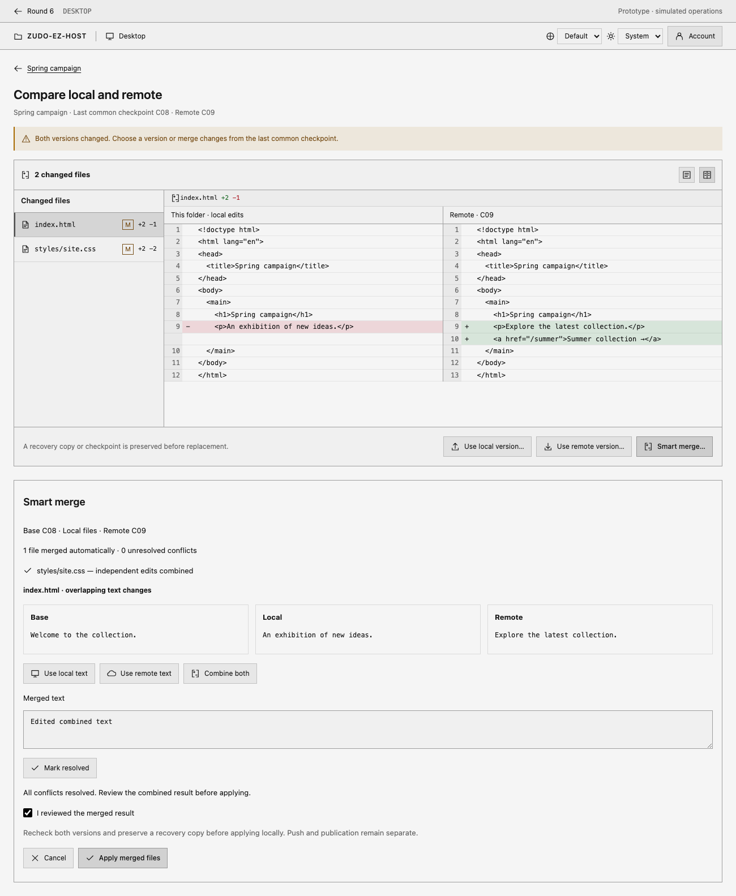

Expected: Third Smart merge action with base/local/remote, auto-merged files and unresolved blocking; explicit local apply. Forbidden: Diff dialog, unresolved apply, automatic cloud push/publication. Unknown: Production merge algorithm, non-text conflict editors and transfer timing. Viewport: 1300×950, full-page; also verify 760 and 390 widths with no page overflow, stacked panels and narrow unified diffs.

### smart-merge-390.png

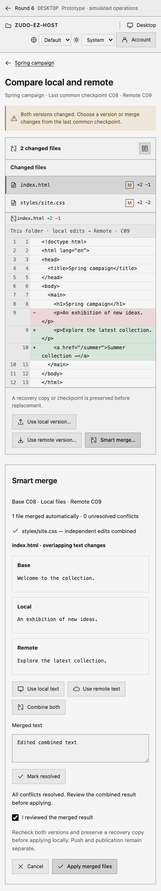

Expected: Third Smart merge action with base/local/remote, auto-merged files and unresolved blocking; explicit local apply. Forbidden: Diff dialog, unresolved apply, automatic cloud push/publication. Unknown: Production merge algorithm, non-text conflict editors and transfer timing. Viewport: 390×950, full-page; also verify 760 and 390 widths with no page overflow, stacked panels and narrow unified diffs.

## Cleanup ownership

The design task migrates the durable app skill. The final docs/cleanup task removes this entire epic resource directory before the root PR merges to main. Keep permanent scanner exclusion plumbing. Do not leave application imports, runtime assets or durable docs dependent on these temporary resources.
